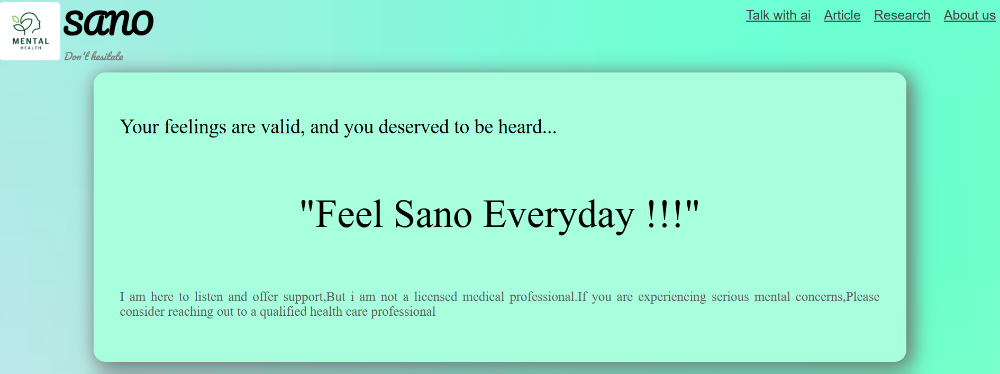
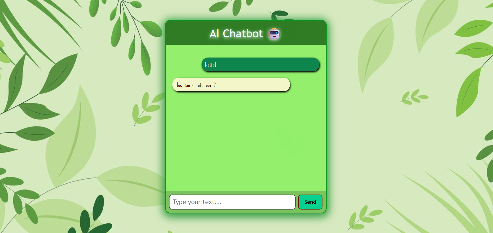
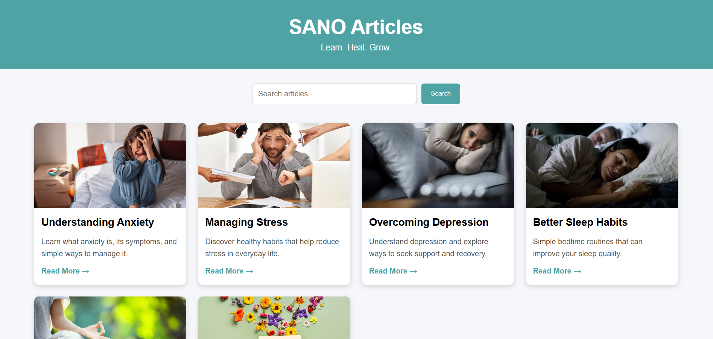
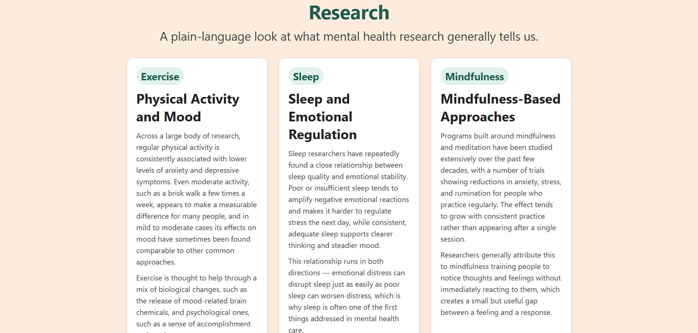
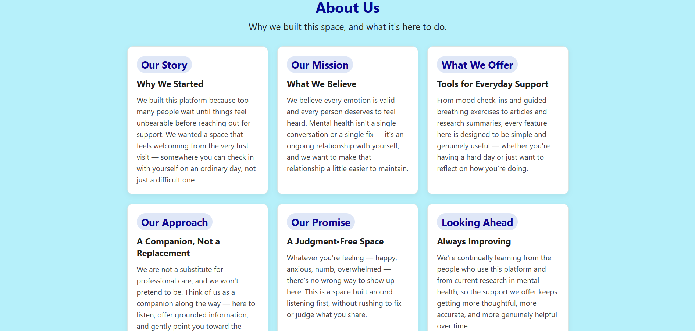
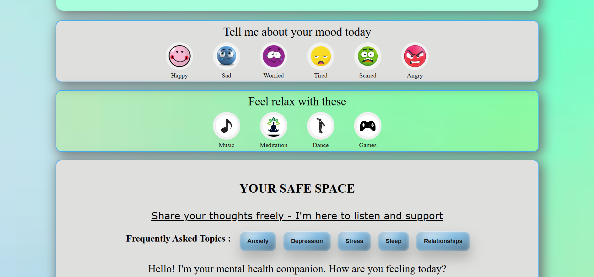
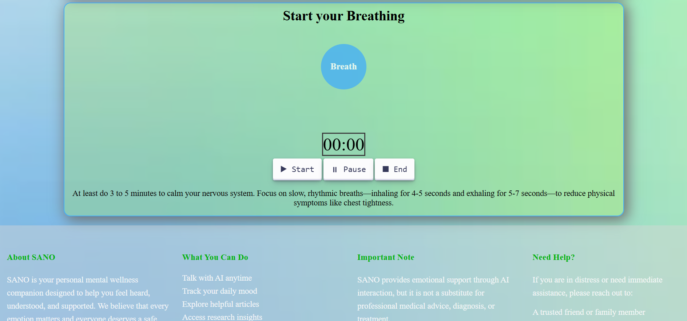

#  SANO – Mental Healthcare & Support Platform

SANO is a web-based mental healthcare support platform designed to provide users with a friendly and accessible space for emotional well-being.

The project combines a conversational support assistant with relaxation activities, meditation, music, mood-based support, articles, and mental health research resources.

> **Disclaimer:** SANO is an educational/support project and is not a replacement for professional medical or mental health care.

---

##  Features


###  SANO Chatbot
- Conversational support assistant named **SANO**
- Provides empathetic and supportive responses
- Designed to avoid diagnosing mental health conditions
- Provides guidance to seek trusted people or emergency services during crisis situations


###  Home Page



###  SANO Chatbot AI

SANO includes an AI-powered conversational assistant that provides friendly and supportive responses to users.

- Powered by **Google Gemini API**
- Built using **Python, Flask, and JavaScript**
- Provides empathetic conversational support
- Responds to users' messages in real time
- Designed not to diagnose mental health conditions
- Encourages users to seek trusted people or professional help during crisis situations


###  Chatbot_AI



###  Mental Health Articles
Users can explore articles and information related to mental health and well-being.


###  Article_Section



###  Mental Health Research
A dedicated section for exploring mental health research and related information.


###  Research Area

- SANO is a mental healthcare and emotional well-being support platform created to provide users with a friendly and accessible digital space for self-care and mental wellness.

The platform combines AI-powered conversational support with mood-based guidance, meditation, breathing exercises, relaxing music, articles, and mental health research resources.

SANO was developed as a practical project to explore how web development and AI technology can be combined to create a supportive and user-friendly mental wellness platform.

> **Note:** SANO is an educational/support project and does not provide professional medical diagnosis or treatment.

###  About Us


```
###  Mood Support
Users can select different moods such as:

- Happy
- Sad
- Worried
- Tired
- Scared
- Angry

The website provides supportive suggestions based on the selected mood.

```
```
###  Relaxing Music
The platform provides different categories of music for relaxation and emotional well-being.


###  Meditation 
- Meditation is the practice of stepping back from your thoughts, allowing your mind to rest and instantly releasing the grip of mental pressure.


### Dancing
- Dance acts as a bridge between the body and the brain, utilizing "somatic intelligence" to unlock and release trapped emotional trauma that traditional talk therapy sometimes cannot reach.


### Gaming
- Gaming serves as a cognitive playground that improves mental health by providing safe spaces to fail, practice emotional regulation, and achieve a deep state of mental focus.

```

```
###  Knowledge Section
Users can gain knowledge of different topics such as:

- Anxiety 
- Depression 
- Stress 
- Sleep
- Relationships

```

###  Mood Checker and Control



##  Technologies Used

### Frontend
- HTML5
- CSS3
- JavaScript

### Backend
- Python
- Flask
- Flask-CORS

### Other Tools
- Python Dotenv
- LocalStorage for chat history

---

##  Project Structure

```text
Mental Healthcare/
│
├── static/
│   ├── images/
│   ├── song/
│   ├── about.css
│   ├── article.css
│   ├── article.js
│   ├── chatbot.css
│   ├── chatbot.js
│   ├── code.js
│   ├── frontpage.css
│   ├── meditation.css
│   ├── music.css
│   └── research.css
│
├── templates/
│   ├── about.html
│   ├── article.html
│   ├── chatbot.html
│   ├── frontPage.HTML
│   ├── meditation.html
│   ├── music.html
│   └── research.html
│
├── chatbot.py
└── README.md
```

##  How to Run the Project

### 1. Clone the repository
```bash
https://github.com/farhanaCodes/SANO-Mental-Healthcare-AI
```

### 2. Open the project folder
```bash
cd "Mental Healthcare"
```

### 3. Install the required packages
```bash
pip install flask flask-cors python-dotenv google-genai
```

### 4. Create a `.env` file

Create a file named:
```
.env
```

Add your API key:
```
GEMINI_API_KEY=YOUR_API_KEY_HERE
```


### 5. Start the Flask server
```bash
python chatbot.py
```

### 6. Open the website

Go to:
```
http://127.0.0.1:5000/
```

The Frontpage is available at:
```
http://127.0.0.1:5000
```

The chatbot is available at:
```
http://127.0.0.1:5000/chatbot
```

---

##  Environment Variables

The project uses an environment variable for the API key.

```
GEMINI_API_KEY=YOUR_API_KEY_HERE
```

---

##  How the Chatbot Works

The chatbot follows this flow:

```
User
  ↓
Chatbot Interface
  ↓
chatbot.js
  ↓
Flask /chat API
  ↓
Backend processing
  ↓
Generated response
  ↓
Chatbot Interface
```

The frontend sends the user's message to the Flask backend using a POST request. The backend processes the message and returns a generated response to the browser.

---


##  Breathing Exercise
- Guided breathing exercises
- Inhale, hold, and exhale cycles
- Breathing session timer
- Pause and end controls


SANO includes a simple breathing exercise based on:

**Inhale → Hold → Exhale**

The interface includes:
- Session timer
- Start button
- Pause button
- End button
- Animated breathing circle

This feature is designed to encourage relaxation and mindful breathing.


###  Breathing_Process


---


##  Project Goals

The main goals of SANO are to:

- Create an accessible mental health support platform
- Provide simple relaxation and breathing activities
- Encourage users to learn more about mental health
- Practice full-stack web development
- Explore the integration of conversational assistants into a web application

---

##  Future Improvements

Possible future improvements include:

-  Conversation history stored securely in a database
-  User accounts and authentication
-  Improved responsive UI for mobile devices
-  More personalized wellness recommendations
-  Voice input and voice responses
-  Multi-language support
-  Mood tracking and visualization
-  Wellness reminders
-  Improved privacy and security
-  Better crisis-resource handling based on the user's location

---

##  Disclaimer

SANO is a student/educational software project intended to provide general emotional support and mental health information.

It does not provide medical diagnoses, professional therapy, or emergency medical services.

If someone is experiencing a mental health crisis or is in immediate danger, they should contact an appropriate emergency service or qualified mental health professional.

---

##  Author

**Farhana Sultana**

This project was developed as a practical project to explore:
- Web development
- Flask
- JavaScript
- Mental health technology


### Backend
- Python
- Flask
- Flask-CORS

### AI
- Google Gemini API
- google-genai

### Other Tools
- Python Dotenv
- LocalStorage for chat history
  
---

##  Acknowledgements
- Flask
- Python
- Open-source web development resources

---

##  Project Status

 Currently under development

New features and improvements may be added in the future.
